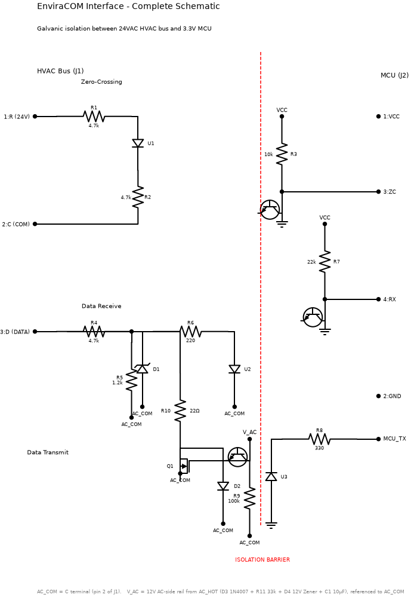
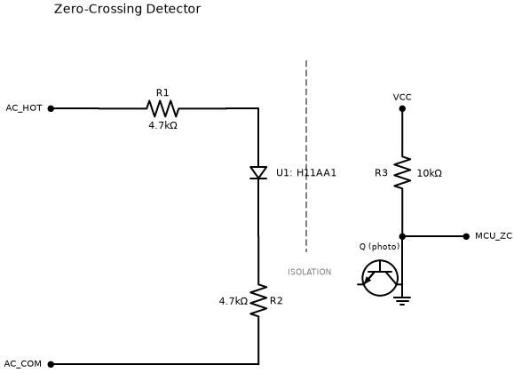
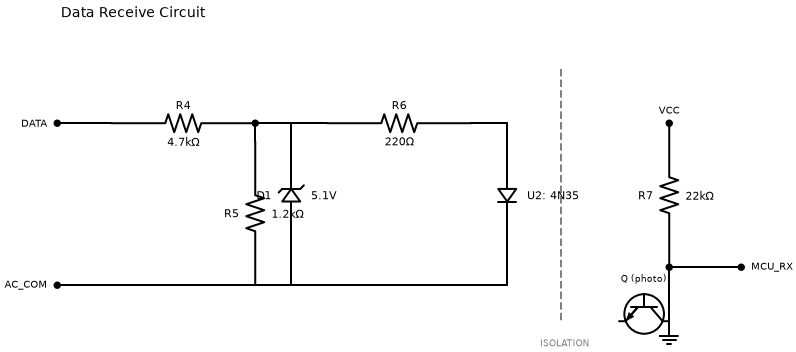
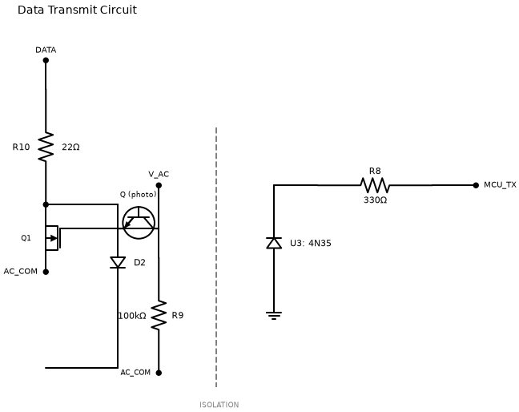

# EnviraCOM Interface — Beginner's Build Guide

Step-by-step instructions for wiring the isolated EnviraCOM interface on a
breadboard, written for someone with little or no electronics background.
The reference design lives in
[`enviracom_interface.md`](enviracom_interface.md); this guide translates it
into point-to-point wiring you can follow with parts in hand.

The schematic images referenced below are generated into
[`generated/`](generated/) — regenerate them any time with:

```bash
python -m tools.hardware.enviracom_schematic --format png
```

---

## ⚠ Before you touch anything

- **Turn the HVAC system off at the breaker** before connecting or changing
  any wiring. The bus runs at 24VAC — it won't usually hurt you, but it can
  hurt your parts and your furnace's control board.
- **Keep the original thermostat** so you can always put things back.
- **Build and test the receive side first.** Don't wire or drive the
  transmit section until you can capture traffic reliably — a stuck
  transmitter jams the whole bus.

## What you're building

The furnace bus has three screw terminals:

| Terminal | Meaning |
|----------|---------|
| **R** | 24VAC power ("hot") |
| **C** | Common — the reference everything on the bus side is measured against |
| **D** | Data — swings between ~0V (driven) and 12–18V (idle) |

This circuit lets an ESP32/Arduino listen to **D** — and later talk on it —
without ever connecting the microcontroller's ground to the furnace's wiring.

**The one idea that organizes the whole build:** there are two electrically
separate worlds, and the only things that cross between them are beams of
light inside three optocoupler chips.

| AC side (furnace) | MCU side (ESP32) |
|-------------------|------------------|
| Referenced to the **C** terminal (called `AC_COM` in the schematics) | Referenced to the ESP32's **GND**, powered from its **3.3V** pin |
| R1, R2, R4–R6, R9–R11, D1–D4, C1, Q1, and each optocoupler's LED or phototransistor half as noted per section | R3, R7, R8, C2, and the other half of each optocoupler |

**Rule of thumb while wiring:** a wire may connect to **C** *or* to ESP32
**GND** — never form a path between both. If you ever find yourself joining
the two with copper, stop: that's a wiring error. On a breadboard, keep the
two halves of the circuit on opposite ends of the board, with the
optocouplers straddling the middle.

## Parts checklist

Values matter — R1/R2 in particular must be 4.7kΩ (an older revision of this
design said 33kΩ, which doesn't work at all).

| Ref | Part | Notes |
|-----|------|-------|
| U1 | H11AA1 optocoupler, 6-pin DIP | Zero-crossing detector — must be the AC-input type |
| U2 | 4N35 optocoupler, 6-pin DIP | Receive isolation |
| U3 | 4N35 optocoupler, 6-pin DIP | Transmit isolation |
| Q1 | 2N7000 MOSFET, TO-92 | Transmit driver |
| R1, R2 | 4.7kΩ ¼W (×2) | Zero-cross current limit |
| R3 | 10kΩ ¼W | ZC pull-up (MCU side) |
| R4 | 4.7kΩ ¼W | Receive divider, top |
| R5 | 1.2kΩ ¼W | Receive divider, bottom |
| R6 | 220Ω ¼W | Receive LED current |
| R7 | 22kΩ ¼W | RX pull-up (MCU side) |
| R8 | 330Ω ¼W | Transmit LED current (MCU side) |
| R9 | 100kΩ ¼W | Gate pull-down |
| R10 | 22Ω **1W** | Transmit current limit — needs the 1-watt part |
| R11 | 33kΩ ¼W | V_AC supply series resistor |
| D1 | 5.1V Zener (e.g. 1N4733A) | Receive input clamp |
| D2 | 1N4148 | Transmit clamp |
| D3 | 1N4007 | V_AC rectifier |
| D4 | 12V Zener (e.g. 1N4742A) | V_AC regulator |
| C1 | 10µF 50V electrolytic | V_AC filter — 50V rating, polarity matters |
| C2 | 100nF ceramic | ESP32 supply decoupling |

## Reading the parts

### Optocouplers (U1, U2, U3)

Hold the chip with the notch (or molded dot) at the top-left. Pins count
**counterclockwise** from there — 1, 2, 3 down the left side, then 4, 5, 6
back up the right side:

```
          notch/dot
         ┌────∪────┐
 LED  A 1│         │6 Base   (leave open)
 LED  K 2│         │5 Collector
     NC 3│         │4 Emitter
         └─────────┘
       (viewed from the top)
```

**The classic mistake:** pin 4 is the *emitter* and pin 5 is the *collector*.
Many hand-drawn diagrams swap them, and the chip then does almost nothing.
Pins 3 and 6 stay unconnected.

### Everything else

- **Diodes & Zeners** (D1–D4): the painted band marks the **cathode**. When a
  step says "band toward X", that's this stripe.
- **2N7000** (Q1): flat face toward you, legs pointing down — left leg is
  **Source**, middle is **Gate**, right is **Drain**.
- **Electrolytic capacitor** (C1): the striped side is negative (−). It goes
  to **C**.
- **Resistors** have no polarity — either way around is fine.

## The complete schematic



The red dashed line is the isolation barrier — notice that every wire stops
at an optocoupler before crossing it. All the `AC_COM` labels are the same
node: the **C** terminal.

Don't try to build from this page-sized view. Build one section at a time
from the close-ups below, in order — each is independently testable.

## Section 1 — Zero-crossing detector

Gives the ESP32 a 120-per-second heartbeat synced to the AC mains, which the
bus uses as its bit clock.



1. **R** terminal → one leg of **R1** (4.7k). Other leg of R1 → **U1 pin 1**.
2. **U1 pin 2** → one leg of **R2** (4.7k). Other leg of R2 → **C** terminal.
   *(The H11AA1 has two LEDs back-to-back inside, so this AC hookup has no
   "wrong way around".)*
3. ESP32 **3.3V** → one leg of **R3** (10k). Other leg of R3 → **U1 pin 5**.
4. **U1 pin 5** also → ESP32 **GPIO 4** (the ZC input) — same breadboard row
   as R3's leg.
5. **U1 pin 4** → ESP32 **GND**. Pins 3 and 6: leave empty.

**Signal:** the pin sits LOW and pulses HIGH ~120×/second, each pulse
centered on a zero-crossing. Trigger on the rising edge.

## Section 2 — Data receive

Turns the bus's 0–15V data swings into clean 3.3V logic. Build this plus
Section 1 and you can sniff traffic.



Pick one breadboard row to be the divider node — call it `RX_DIV`. Four
things connect to it:

1. **D** terminal → **R4** (4.7k) → `RX_DIV`.
2. `RX_DIV` → **R5** (1.2k) → **C**.
3. `RX_DIV` → **D1** (5.1V Zener), *band toward RX_DIV* → **C**.
   *(Protection only — it clamps spikes and shouldn't conduct in normal
   operation.)*
4. `RX_DIV` → **R6** (220Ω) → **U2 pin 1**. Then **U2 pin 2** → **C**.
5. ESP32 **3.3V** → **R7** (22k) → **U2 pin 5**, and **U2 pin 5** → ESP32
   **GPIO 5** (RX input).
6. **U2 pin 4** → ESP32 **GND**.

**Signal is inverted:** bus idle/high (12–18V) reads as pin LOW; bus driven
low reads as pin HIGH. Flip it in software.

## Section 3 — V_AC supply

The transmit driver needs a little DC power that belongs to the *furnace's*
world, so it can switch the MOSFET without borrowing the ESP32's power
(which would defeat the isolation). Three parts make a crude 12V rail called
`V_AC`.

1. **R** terminal → **D3** (1N4007), *band away from R* → one leg of **R11**
   (33k).
2. Other leg of R11 → a free breadboard row: this row is `V_AC`.
3. `V_AC` → **D4** (12V Zener), *band toward V_AC* → **C**.
4. `V_AC` → **C1** (10µF) positive leg; striped negative leg → **C**.

**Sanity check with power on:** a DC voltmeter from `V_AC` to **C** should
read roughly 11–13V.

## Section 4 — Data transmit

**Leave this section unpowered/unconnected until receive works** and you
understand the protocol — a stuck transmitter jams the whole bus.



1. ESP32 **GPIO 18** (TX output) → **R8** (330Ω) → **U3 pin 1**. Then
   **U3 pin 2** → ESP32 **GND**. *(This is the only MCU-side piece of this
   section.)*
2. **U3 pin 5** → `V_AC` (from Section 3).
3. **U3 pin 4** → **Q1's Gate** (middle leg).
4. Q1 Gate also → **R9** (100k) → **C**. *(Guarantees the MOSFET stays off
   when the ESP32 isn't driving.)*
5. **Q1 Source** (left leg, flat face toward you) → **C**.
6. **D** terminal → **R10** (22Ω 1W) → **Q1 Drain** (right leg).
7. **D2** (1N4148) between Q1 Drain and **C**, *band toward the Drain*.
8. Finally: **C2** (100nF) between ESP32 **3.3V** and **GND**, close to the
   board.

**Logic:** GPIO HIGH pulls the bus low (a "dominant" bit); GPIO LOW releases
it. Boot with the pin LOW. Before ever transmitting, measure the bus's
short-circuit current from **D** to **C** — if it's more than ~150mA, R10
needs to be bigger to protect Q1.

## Hooking up the ESP32

| Interface net | ESP32 pin | Direction | Notes |
|---------------|-----------|-----------|-------|
| VCC | 3V3 | power | Powers the R3/R7 pull-ups and U3's LED |
| GND | GND | power | MCU-side ground only — never touches C |
| MCU_ZC | GPIO 4 | input | Pulses HIGH at each zero-crossing; rising-edge interrupt |
| MCU_RX | GPIO 5 | input | Inverted bus data |
| MCU_TX | GPIO 18 | output | HIGH = drive bus low. Keep LOW at boot |

GPIO numbers match the example sketch in
[`enviracom_interface.md`](enviracom_interface.md); any interrupt-capable
pins work.

## First power-up

1. **Check the barrier.** With everything wired and *unpowered*, set a
   multimeter to continuity: between ESP32 **GND** and the **C** terminal
   there must be **no** continuity.
2. **Power the HVAC back on** (ESP32 still disconnected from USB). Verify
   ~24VAC between **R** and **C**, and ~11–13V DC from `V_AC` to **C**.
3. **Connect and power the ESP32.** `MCU_ZC` should show a steady 120Hz
   pulse train — easiest to check in firmware by counting interrupts for one
   second (expect ≈120).
4. **Watch `MCU_RX`.** It should sit LOW (bus idle is high — remember the
   inversion) and burst with activity when the thermostat talks.
5. **Capture passively for a good while** before even thinking about
   transmit.

---

*The USB (CH340) variant exists in the repo, but this MCU version is the
recommended build: a plain USB-UART bridge can't do the zero-cross-
synchronized bit timing in hardware.*
